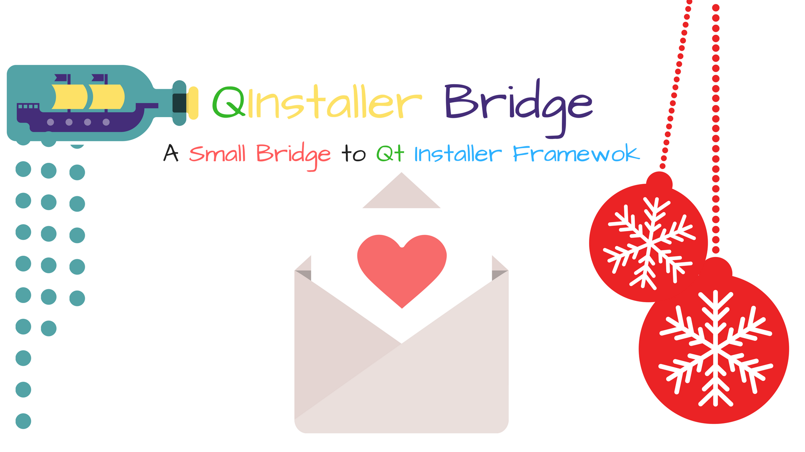

     

> :roller_coaster: A small header writen in C++ using Qt5 to :computer: communicate with the Qt Installer Framework :eyeglasses: . This header helps you   
> to check the remote repo :white_check_mark: and also update to the latest version! :dog:   
> --Antony Jr.

# QInstallerBridge     

Ever wanted to make your applications work with the flow but stuck with Qt's **Maintanance Tool** ?. I belive that updates should   
be just installed without any complications but that does not mean **Qt Installer Framework** is a bluff , its actually the coolest   
thing a vendor can have. With Qt's Installer Framework you can ship your packages to **Linux , Windows and Mac** with a   
cross-platform gui installer but the one thing that sucks is that Qt does not provide a auto update officially but it does have the   
**Maintanance Tool** which can **auto update**. Some cool folks used **QProcess** to communicate with the Maintanance Tool and   
that did work as a hotfix but I needed a **solid** and **clean API** to communicate with Qt's Maintanance Tool and   
thus **QInstallerBridge** was born.

**QInstallerBridge** is a small header writen in C++ using Qt5 , This supports async structure and thus it is best suited   
for your Qt Projects. **QInstallerBridge** does not depend on **Qt's Maintanance Tool** , it just works on its own and   
handles Qt's Remote Repo very well. **It also communicates with the Maintanance Tool's configuration** to make the   
Maintanance Tool know that we have updated to the latest version.   
This makes **QInstallerBridge** to act without **Maintanance Tool** and also flows with it!   

**You can also just distribute your app with components.xml to use QtInstallerBridge without the Qt Installer Framework**
Cool , Right ?...

**Note** : Eventhough you do not need to install your packages with Qt Installer Framework , you need Qt' Remote Repo.   
           Which is generated with **repogen** from the Qt Installer Framework.

**Warning** : The **components.xml** should match the configuration with Qt's Remote Repo's **Updates.xml**.   
              That is common sense , right ?...
              

Please refer the **documentation** for more information. ( Will soon be available! )   
**Open issues** if you have any doubts , I will gladly answer you :heart: !

### Some Cool Folks who use QProcess to Auto Update

* [Skycoder42](https://github.com/Skycoder42/QtAutoUpdater)
* [Jordanbaucke](https://github.com/jordanbaucke/qtautoupdater_cmake)
* [A StackOverflow that roots for QProcess](https://stackoverflow.com/questions/34318934/qt-installer-framework-auto-update)

### Some Similar Projects

* [AutoUpdater-Qt by speedovation](https://github.com/speedovation/AutoUpdater-Qt)   
       
    The disadvantage in this project is that , it does not communicate with the Qt Maintanance Tool and thus the user is forced   
    to use Qt Installer Framework only or the authors AutoUpdater Only. And you cannot update the updater itself!
    
    **AutoUpdater-Qt** does not provide a async structure too and thus it is impossible to make your own AutoUpdate Windows!
    But I recommend this if you want a very quick fix for non-production ready apps!
    
    **Disclaimer** : No offence but , This tool only handles with zip files and there is no documentation.   
                     I don't know anything specific about this project!

           
           
<!-- $ curl -L "https://git.io/vbdkW" | bash-->

# Getting Started

Learn more about **QInstallerBridge** at the official [QInstallerBridge Documentation](https://antony-jr.github.io/QInstallerBridge)

# Thank You 

I really need to thank the developers of this libraries for creating it because QInstallerBridge is elegant because of them! :heart:   

* [QArchive](https://github.com/antony-jr/QArchive)
* [QEasyDownloader](https://github.com/antony-jr/QEasyDownloader)
* [Qt](https://github.com/qt)

# Support  

If you think that this project is **cool** then you can give it a :star: or :fork_and_knife: it if you want to improve it with me. I really :heart: stars though!   

    

If you want to do something that stands out then you can click the **donate** button at the top to make a monthly donation , So   
I will make sure that I stay healthy and keep on to do my work. :briefcase: Supporting me means supporting all of my projects , So   
you are like **Tony Stark** :heart: who backs **Spider-Man**! Thank you for your extra care! :dog:   

You can also tweet about me on twitter , get connected with me [@antonyjr0](https://twitter.com/antonyjr0)

Thank You! :smiley_cat:

# License

The BSD 3-clause "New" or "Revised" License.

Copyright (C) 2017 , antony jr.   
All Rights Reserved.
